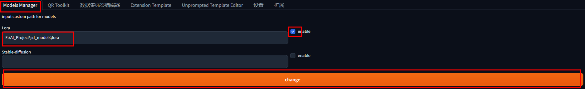
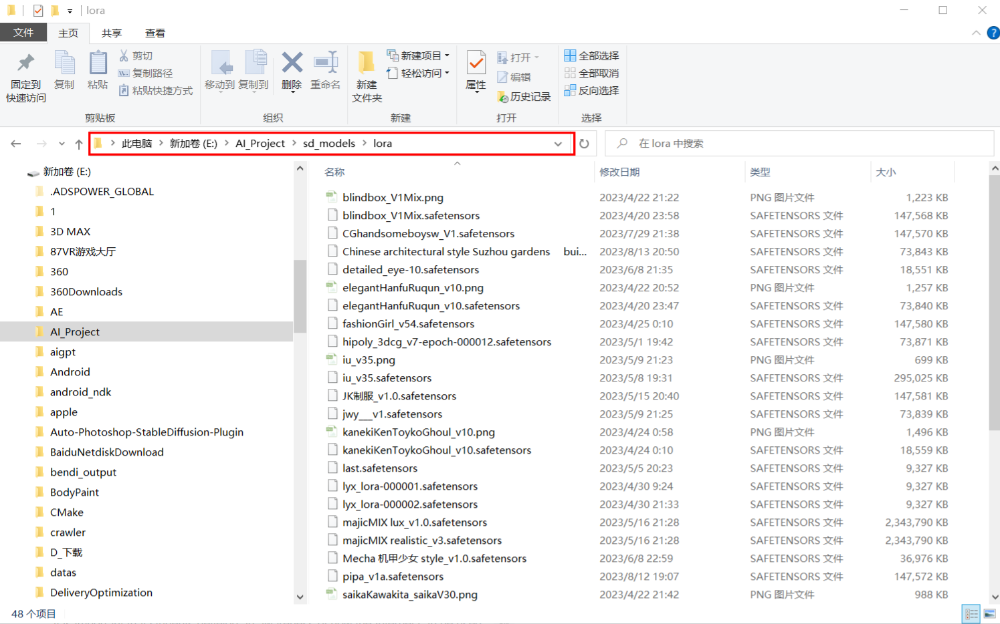

# [sd-webui-models-manager](https://github.com/dhs964057117/sd-webui-models-manager)

## 插件作用?

这是一款为 [Stable Diffusion web UI](https://github.com/AUTOMATIC1111/stable-diffusion-webui) 设计的插件，主要用于修改模型文件的保存路径。

面临以下情况时，将模型移动到另一个位置可能会很有用：

- 主磁盘磁盘空间不足

- 您正在多个工具中使用模型，不想将它们存储两次

Web UI默认的模型文件夹是 `stable-diffusion-webui/models`

## 插件安装

1. 打开“扩展”选项卡
2. 打开扩展选项卡中的 "从URL下载（Install from URL）" 选项卡
3. 在"URL for extension's git repository"这一项中输入插件地址 .
4. 点击下载（install.
5. 刷新模型或者重启 Web UI.

## 如何使用?

​	1. 把你的模型全部移动到一个你想存放的文件夹里

例如:

我的Web UI的安装路径是 "D:\stable-diffusion-webui"

然后我的模型文件路径是 "D:\stable-diffusion-webui\models" 

将models下你想移动的模型文件。

例如Lora的模型文件"D:\stable-diffusion-webui\models\Lora" 中的全部文件移动到

新建的文件"E:\AI_Project\sd_models\lora"中

2. 选择 "models Manager"选项卡，并在对应模型的输入框中 输入你更改后的新路径

点击按钮应用，此时刷新模型或者重启Web UI即可正常使用模型

## Windows问题！！（Linux无该问题）

注意！！！！如果你的Lora文件下面是<b>文件夹</b>。例如下图情况1“真人写实LORA”

则  **可以直接运行。**

如果你的Lora文件下面是<b>文件</b>。例如下图情况2

则  **需要打开开发者模式后才能正常使用！**

如果你点击后出现类似下面的错误:

 

需要你在开始菜单旁边的搜索中搜索**开发者选项**。打开后重新配置即可正常使用

