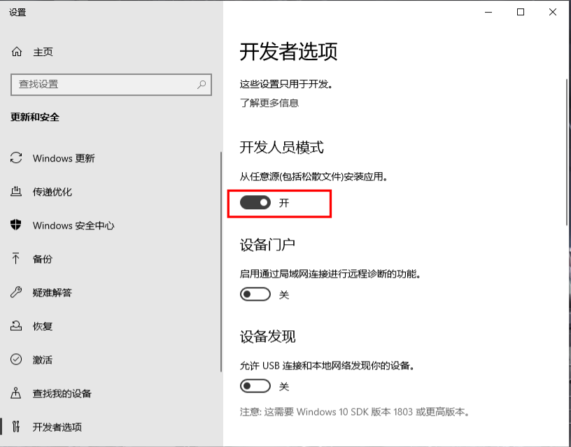

# [sd-webui-models-manager](https://github.com/dhs964057117/sd-webui-models-manager)

·English · [简体中文](./README-zh_CN.md)

## What it is?

it is an extension for [Stable Diffusion web UI](https://github.com/AUTOMATIC1111/stable-diffusion-webui) to manager your models path

can change your models save path 

## Installation

1. Open "Extensions" tab.
2. Open "Install from URL" tab in the tab.
3. Enter URL of this repo to "URL for extension's git repository".
4. Press "Install" button.
5. Restart Web UI.

## How to use it?

1.move yours models dir to another path

eg:

my webui workspace is "D:\stable-diffusion-webui"

then i move the lora models to "E:\AI_Project\sd_models\lora"

2.next select the tab "models Manager" input your new path

click the enable and change。

if your system is Windows maybe got some errors info like this:

 

now you should open the developer mode and try again

